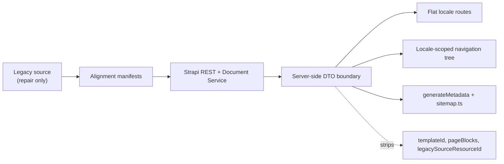

# Next.js Content-First Readiness

## Verdict

- Practical UI-start readiness score: `85/100`.
- Machine-generated content score remains `84/100`; the +1 UI-start adjustment reflects the completed RU navigation sync and verified Strapi navigation render state.
- Decision: `CONDITIONAL GO` for a bilingual, content-first Next.js App Router launch with `no map in v1`.
- Baseline from the earlier readiness pass was `78/100`; this implementation raises the local rehearsal score by adding `menuTitle`, clearing duplicate `pageBlocks`, and proving the remaining localized drift against source evidence.

## Score Breakdown

| Area | Score | Why |
| --- | ---: | --- |
| Contract/API | `30/30` | Semantic contract is populated, legacy fields are private in REST, tags expose canonical `slug`, `menuTitle` is part of the page schema, and a DTO/verifier now exist. |
| Routing/navigation | `19/20` | No published slug collisions, source-parent integrity issues pending: `0`, and the RU Navigation plugin tree now dry-runs cleanly at `8 -> 8` roots after sync. |
| Localization parity | `13/20` | `136` bilingual docs exist, and the current `37` structural drifts are now documented as localized source truth rather than assumed migration bugs. |
| Content quality | `17/20` | Contact placeholders, malformed clinics, legacy `` wrappers, and duplicate `pageBlocks` were removed; social legacy handling and missing clinic coordinates remain. |
| Operational readiness | `6/10` | Forward-only Postgres index artifacts exist, but the live rehearsal DB still full-scans key queries and remains SQLite-only. |

## Implemented In This Pass

- Added localized `menuTitle` to the Strapi `Page` contract and backfilled the live rows that still carried a distinct legacy menu label.
- Generated a contract-fix plan from the current legacy-block classifier and verified that there are no safe `pageType` or `layoutVariant` auto-fixes pending.
- Generated a source-alignment manifest showing that the remaining cross-locale structural drift is localized source truth and should stay localized for Next.js.
- Removed duplicate legacy `pageBlocks` from the published semantic pages in two cleanup batches after parity checks passed.
- Extended the Next.js DTO example with `menuTitle`, `navLabel`, `seoTitle`, and a metadata helper for `generateMetadata`/`noindex` handling.
- Synced the RU Strapi Navigation plugin tree from `Page.parentPage`; the post-sync dry-run is clean and stale newly-parented nav items are `0`.
- Added a read-only content hygiene audit script and a durable link-repair manifest for the `14` remaining potential broken internal references.

## Architecture

## Current Facts

- Published pages: `325` localized rows across `189` canonical docs.
- Bilingual docs: `136`. Greek-only docs: `46`. Russian-only docs: `7`.
- Structural drift docs: `37`.
- Published source-parent integrity issues: `0`.
- Legacy semantic + `pageBlocks` duplication: `0` localized pages across `0` canonical docs.
- Internal `pageBlocks` storage leftovers: `358` old component-link rows, `0` attached to published pages.
- `menuTitle` backfill status: `21` applied, `0` pending.
- SEO review queue: `13` localized pages where legacy `longtitle` still adds signal over the current `seo.metaTitle`.
- Published slug collisions: `0`.
- Published clinics without coordinates: `6`.
- Published social links with unresolved platform mapping: `1`.
- Content hygiene audit: `1,422` extracted links, `14` potential internal broken references, `259` legacy HTML-marker sources, `0` unsafe script/event-handler findings, and `0` empty content leaf pages.
- Strapi navigation render roots: `el=7`, `ru=8`. Rendered navigation paths can be nested, so Next.js must use `Page.slug` or `uiRouterKey` for flat routes.

## Remaining Risks

- 37 bilingual documents still drift on template, page type, layout, or parent linkage, even though 37 are now authenticated against source.
- 13 localized pages still need editorial review because legacy longtitle adds SEO signal over the current seo.metaTitle.
- 1 published social link still cannot be mapped to a supported platform and should stay hidden in v1.
- 6 published clinic cards still lack coordinates, so map UI remains out of scope for v1.
- 14 potential internal hrefs still need a reviewed link-repair data migration before content freeze.
- Migrated rich HTML still contains legacy presentational markup (``, inline styles/classes, and iframes); the Next.js renderer should sanitize and style it deliberately.
- Route lookup and service listing queries still full-scan the current SQLite rehearsal DB until the Postgres index rollout is applied.

## Artifacts

- Machine-readable readiness report: [nextjs_content_readiness.json](../nextjs_content_readiness.json)
- Structural review manifest: [nextjs_structural_review_manifest.json](../nextjs_structural_review_manifest.json)
- Legacy cleanup manifest: [nextjs_legacy_cleanup_manifest.json](../nextjs_legacy_cleanup_manifest.json)
- Source alignment manifest: [nextjs_source_alignment_manifest.json](../nextjs_source_alignment_manifest.json)
- Parent-fix plan: [nextjs_parent_fix_plan.json](../nextjs_parent_fix_plan.json)
- Contract-fix plan: [nextjs_page_contract_fix_plan.json](../nextjs_page_contract_fix_plan.json)
- `menuTitle` backfill plan: [nextjs_menu_title_backfill_plan.json](../nextjs_menu_title_backfill_plan.json)
- SEO review manifest: [nextjs_seo_review_manifest.json](../nextjs_seo_review_manifest.json)
- Content hygiene audit script: [audit_nextjs_content_hygiene.py](../audit_nextjs_content_hygiene.py)
- Internal link repair manifest: [nextjs_internal_link_repair_manifest.json](../nextjs_internal_link_repair_manifest.json)
- PageBlocks cleanup batches: [nextjs_pageblocks_cleanup_batch_a.json](../nextjs_pageblocks_cleanup_batch_a.json), [nextjs_pageblocks_cleanup_batch_b.json](../nextjs_pageblocks_cleanup_batch_b.json)
- Next DTO example: [next_page_dto.ts](../examples/next_page_dto.ts)
- ADRs: [ADR-001](./adr/ADR-001-nextjs-semantic-dto-boundary.md), [ADR-002](./adr/ADR-002-nextjs-v1-contact-and-system-pages.md), [ADR-003](./adr/ADR-003-postgres-readiness-indexes.md), [ADR-004](./adr/ADR-004-flat-locale-routes-and-localized-navigation-labels.md), [ADR-005](./adr/ADR-005-repair-source-parent-integrity-before-postgres-cutover.md)
- Postgres readiness SQL: [001_pages_lookup_indexes.sql](../backend/database/postgres-readiness/001_pages_lookup_indexes.sql), [002_tag_slug_indexes.sql](../backend/database/postgres-readiness/002_tag_slug_indexes.sql)

## Next Plan

1. Keep `pageType`, `layoutVariant`, `templateId`, and localized `parentPage` differences when the source-parent integrity check is clean.
2. Resolve the SEO review queue, the remaining `Google Plus` social row, and the `14`-href internal link repair manifest before content freeze.
3. Build the Next.js app against the DTO boundary only: locale-scoped navigation, flat locale routes, semantic page rendering, no maps in v1, and frontend-native `404`, `search-results`, and `sitemap` routes.
4. Rehearse the PostgreSQL index rollout on a copy before any shared or production deployment.
