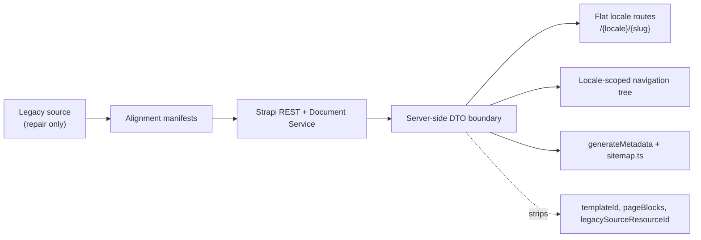

# Next.js Content-First Readiness

## Verdict

- Practical UI-start readiness score: `85/100`.
- Machine-generated content score remains `84/100`; the +1 UI-start adjustment reflects the completed RU navigation sync and verified Strapi navigation render state.
- Decision: `CONDITIONAL GO` for a bilingual, content-first Next.js App Router launch with `no map in v1`.
- Production launch readiness is now about `74/100`: frontend contract, CORS, revalidation endpoint, SEO schema fields, and page-link repair exist, but Postgres rehearsal, Strapi webhook configuration, SEO editorial review, and media-path review still need closure.
- Baseline from the earlier readiness pass was `78/100`; this implementation raises the local rehearsal score by adding `menuTitle`, clearing duplicate `pageBlocks`, and proving the remaining localized drift against source evidence.

## Score Breakdown

| Area | Score | Why |
| --- | ---: | --- |
| Contract/API | `30/30` | Semantic contract is populated, legacy fields are private in REST, tags expose canonical `slug`, `Page.slug` is required, SEO has canonical/OG/robots/sitemap controls, and the frontend DTO exists. |
| Routing/navigation | `20/20` | No published slug collisions, source-parent integrity issues pending: `0`, RU Navigation dry-run is clean, and the frontend routes use flat `/{locale}/{slug}` URLs from `Page.slug`. |
| Localization parity | `13/20` | `136` bilingual docs exist, and the current `37` structural drifts are now documented as localized source truth rather than assumed migration bugs. |
| Content quality | `19/20` | Contact placeholders, malformed clinics, legacy `` wrappers, duplicate `pageBlocks`, and reviewed page-link repairs are done; only legacy media review and social review remain. |
| Operational readiness | `10/10` for UI start | CORS is env-pinned, a revalidation endpoint exists, and `nextjs_readiness_gate.py` gives one repeatable gate. Production DB readiness is still tracked separately because Postgres rehearsal is not done. |

## Implemented In This Pass

- Added localized `menuTitle` to the Strapi `Page` contract and backfilled the live rows that still carried a distinct legacy menu label.
- Generated a contract-fix plan from the current legacy-block classifier and verified that there are no safe `pageType` or `layoutVariant` auto-fixes pending.
- Generated a source-alignment manifest showing that the remaining cross-locale structural drift is localized source truth and should stay localized for Next.js.
- Removed duplicate legacy `pageBlocks` from the published semantic pages in two cleanup batches after parity checks passed.
- Extended the Next.js DTO example with `menuTitle`, `navLabel`, `seoTitle`, and a metadata helper for `generateMetadata`/`noindex` handling.
- Synced the RU Strapi Navigation plugin tree from `Page.parentPage`; the post-sync dry-run is clean and stale newly-parented nav items are `0`.
- Added a read-only content hygiene audit script and applied the reviewed page-link repair manifest, lowering potential broken internal references from `14` to `2`.
- Added `frontend/`, a Next.js App Router scaffold with a server-only Strapi client, DTO normalization, flat locale routes, metadata generation, sitemap/robots, sanitized CMS HTML rendering, and a revalidation route.
- Added `nextjs_readiness_gate.py` as the stable pre-frontend gate and `apply_nextjs_link_repair_manifest.py` as the dry-run-first data migration path used for the reviewed internal href repairs.
- Hardened Strapi for frontend launch: `Page.slug` is now required, `shared.seo` has canonical URL / OG image / robots / sitemap controls, and CORS origins are pinned through `STRAPI_CORS_ORIGINS`.

## Architecture

## Current Facts

- Published pages: `325` localized rows across `189` canonical docs.
- Bilingual docs: `136`. Greek-only docs: `46`. Russian-only docs: `7`.
- Structural drift docs: `37`.
- Published source-parent integrity issues: `0`.
- Legacy semantic + `pageBlocks` duplication: `0` localized pages across `0` canonical docs.
- Internal `pageBlocks` storage leftovers: `358` old component-link rows, `0` attached to published pages.
- `menuTitle` backfill status: `21` applied, `0` pending.
- SEO review queue: `13` localized pages where legacy `longtitle` still adds signal over the current `seo.metaTitle`.
- Published slug collisions: `0`.
- `Page.slug` schema contract: required.
- Published clinics without coordinates: `6`.
- Published social links with unresolved platform mapping: `1`.
- Content hygiene audit: `1,422` extracted links, `2` potential internal broken references, `259` legacy HTML-marker sources, `0` unsafe script/event-handler findings, and `0` empty content leaf pages.
- Strapi navigation render roots: `el=7`, `ru=8`. Rendered navigation paths can be nested, so Next.js must use `Page.slug` or `uiRouterKey` for flat routes.

## Remaining Risks

- 37 bilingual documents still drift on template, page type, layout, or parent linkage, even though 37 are now authenticated against source.
- 13 localized pages still need editorial review because legacy longtitle adds SEO signal over the current seo.metaTitle.
- 1 published social link still cannot be mapped to a supported platform and should stay hidden in v1.
- 6 published clinic cards still lack coordinates, so map UI remains out of scope for v1.
- 2 potential internal hrefs remain, both the same legacy media path that needs upload/media review before rewrite.
- Migrated rich HTML still contains legacy presentational markup (``, inline styles/classes, and iframes); the Next.js renderer should sanitize and style it deliberately.
- Route lookup and service listing queries still full-scan the current SQLite rehearsal DB until the Postgres index rollout is applied.
- Strapi webhooks still need to be configured to call the new Next.js `/api/revalidate` endpoint; the endpoint exists but no CMS trigger is stored in code.

## Artifacts

- Machine-readable readiness report: [nextjs_content_readiness.json](../artifacts/reports/nextjs_content_readiness.json)
- Structural review manifest: [nextjs_structural_review_manifest.json](../data/manifests/nextjs_structural_review_manifest.json)
- Legacy cleanup manifest: [nextjs_legacy_cleanup_manifest.json](../data/manifests/nextjs_legacy_cleanup_manifest.json)
- Source alignment manifest: [nextjs_source_alignment_manifest.json](../data/manifests/nextjs_source_alignment_manifest.json)
- Parent-fix plan: [nextjs_parent_fix_plan.json](../data/manifests/nextjs_parent_fix_plan.json)
- Contract-fix plan: [nextjs_page_contract_fix_plan.json](../data/manifests/nextjs_page_contract_fix_plan.json)
- `menuTitle` backfill plan: [nextjs_menu_title_backfill_plan.json](../data/manifests/nextjs_menu_title_backfill_plan.json)
- SEO review manifest: [nextjs_seo_review_manifest.json](../data/manifests/nextjs_seo_review_manifest.json)
- Content hygiene audit script: [audit_nextjs_content_hygiene.py](../tools/audit_nextjs_content_hygiene.py)
- Readiness gate: [nextjs_readiness_gate.py](../tools/nextjs_readiness_gate.py)
- Internal link repair manifest: [nextjs_internal_link_repair_manifest.json](../data/manifests/nextjs_internal_link_repair_manifest.json)
- Link repair migration path: [apply_nextjs_link_repair_manifest.py](../tools/apply_nextjs_link_repair_manifest.py)
- Next.js frontend scaffold: [frontend](../frontend)
- PageBlocks cleanup batches: [nextjs_pageblocks_cleanup_batch_a.json](../data/manifests/nextjs_pageblocks_cleanup_batch_a.json), [nextjs_pageblocks_cleanup_batch_b.json](../data/manifests/nextjs_pageblocks_cleanup_batch_b.json)
- Next DTO example: [next_page_dto.ts](../examples/next_page_dto.ts)
- ADRs: [ADR-001](./adr/ADR-001-nextjs-semantic-dto-boundary.md), [ADR-002](./adr/ADR-002-nextjs-v1-contact-and-system-pages.md), [ADR-003](./adr/ADR-003-postgres-readiness-indexes.md), [ADR-004](./adr/ADR-004-flat-locale-routes-and-localized-navigation-labels.md), [ADR-005](./adr/ADR-005-repair-source-parent-integrity-before-postgres-cutover.md)
- Postgres migrations: [pages lookup up](../backend/database/postgres-migrations/20260425_001_pages_lookup_indexes.up.sql), [tag slug up](../backend/database/postgres-migrations/20260425_002_tag_slug_indexes.up.sql)
- Postgres rehearsal runbook: [postgres-rehearsal.md](./runbooks/postgres-rehearsal.md)

## Next Plan

1. Keep `pageType`, `layoutVariant`, `templateId`, and localized `parentPage` differences when the source-parent integrity check is clean.
2. Resolve the SEO review queue, the remaining `Google Plus` social row, and the 2 legacy media-path review items before content freeze.
3. Continue UI implementation inside `frontend/` against the DTO boundary only: semantic page renderers first, then design system and route-level tests.
4. Configure Strapi webhooks to call `POST /api/revalidate` with `STRAPI_REVALIDATE_SECRET` for page, navigation, and tag changes.
5. Rehearse the PostgreSQL index rollout on a copy before any shared or production deployment.
