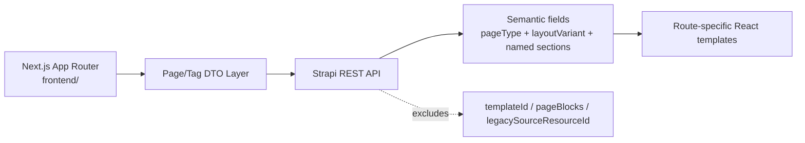

# Strapi Next.js Audit

## Verdict

- Decision: `CONDITIONAL GO` for the new Next.js App Router frontend now scaffolded under `../frontend`.
- Safe path: consume the semantic page contract only: `pageType`, `layoutVariant`, `pageSections` or the one named section field for that page type.
- Not ready for a full parity cutover yet: localized structural drift remains by design, while the SEO review queue, content-link hygiene, social cleanup, and production database hardening still need closure.

This document is the current live-state source of truth for the populated Strapi system. The older `docs/migration/strapi_injection_readiness.md` document remains useful as historical pre-injection context, but it no longer describes the current populated database.

For the current rollout score, structural review manifest, and production-hardening plan, also see `docs/nextjs-content-readiness.md`.

## Live Inventory

| Metric | Value | Notes |
| --- | ---: | --- |
| Physical page rows | `650` | Draft/published row pairs are still present |
| Localized logical pages | `325` | Distinct `documentId + locale` |
| Canonical page documents | `189` | Distinct `documentId` |
| Tag rows | `31` | Locale rows |
| Canonical tag documents | `16` | `15` bilingual + `1` ru-only |
| Bilingual page documents | `136` | Live Strapi documents with both locales |
| Greek-only page documents | `46` | Live Strapi documents |
| Russian-only page documents | `7` | Live Strapi documents |
| Strict source pairs | `123` | From source/Babel audit, stricter than live Strapi bilingual count |

### Structural Drift Across Live Bilingual Documents

| Drift check | Count |
| --- | ---: |
| `templateId` mismatches | `17` |
| `pageType` mismatches | `6` |
| `layoutVariant` mismatches | `23` |
| Parent-page mismatches | `24` |
| `isFolder` mismatches | `7` |
| `menuIndex` mismatches | `67` |
| `externalUrl` mismatches | `1` |

These counts are the main reason structural fields should remain localized for now. De-localizing them before cleanup would freeze bad data into the frontend contract.

Post-parent-repair note: the localized parent mismatches are now source-authenticated. Published source-parent integrity issues are `0`, so the remaining parent differences should be treated as localized IA, not missing relations.

## Payload Audit

Representative published payload summaries from the live document service:

```json
[
  {
    "documentId": "d4sutmel62e6418oo7wm7vy9",
    "locale": "el",
    "title": "Menu",
    "slug": "index",
    "pageType": "home",
    "layoutVariant": "home",
    "sectionComponents": [
      "sections.promo-slider",
      "sections.linked-resources",
      "sections.social-links",
      "sections.video"
    ],
    "promoSlides": { "count": 18, "withTargetPage": 18, "withImage": 18 },
    "linkedResources": { "count": 10, "withTargetPage": 10 },
    "socialLinks": { "count": 4, "nullIcons": 4 },
    "videos": { "count": 1, "withThumbnail": 1 }
  },
  {
    "documentId": "or75ksubaq5h2exns2uga6k0",
    "locale": "el",
    "title": "Πολιτική Απορρήτου",
    "slug": "privacy-policy",
    "pageType": "content",
    "layoutVariant": "standard",
    "contentLength": 6028
  },
  {
    "documentId": "jdsakp5pldnhyiu5bv60mbii",
    "locale": "el",
    "title": "Υπηρεσίες",
    "slug": "yperesies",
    "pageType": "faq",
    "layoutVariant": "service-faq",
    "faqSection": {
      "itemCount": 7,
      "firstQuestion": "Τι είναι η ενδοσκόπηση μύτης και λάρυγγα, αν είναι επώδυνη;"
    }
  },
  {
    "documentId": "af75v2k760st40nppinvq139",
    "locale": "el",
    "title": "Βιοκλινική Αθηνών",
    "slug": "bioclinic-athinwn",
    "pageType": "gallery",
    "layoutVariant": "clinic-gallery",
    "gallerySection": { "itemCount": 4, "withImage": 4 }
  },
  {
    "documentId": "nbsun7tvpb5x9cewbhpkvs84",
    "locale": "el",
    "title": "Επικοινωνία",
    "slug": "epikoinonia",
    "pageType": "contact",
    "layoutVariant": "contact",
    "contactSection": {
      "detailsCount": 3,
      "clinicsCount": 3,
      "clinicsWithCoords": 0,
      "placeholderEmails": 0
    }
  }
]
```

### What the Live Payloads Prove

- The semantic page model is real, populated, and usable for Next.js right now.
- Home page sections already resolve live `targetPage` relations and media:
  - `72/72` promo slides have `targetPage`
  - `40/40` linked resources have `targetPage`
- Structured content is present for FAQ, gallery, and contact pages without needing legacy `pageBlocks`.
- Tags now expose a canonical `slug` in the public Tag API.
- `Page.slug` is now required in the Strapi schema and remains localized for flat frontend routes.
- `shared.seo` now includes canonical URL, OG image, robots, and sitemap controls used by Next metadata and sitemap generation.
- Published pages whose legacy parent is non-root now all have a matching Strapi `parentPage` relation.
- The RU Navigation plugin tree has been synced from `Page.parentPage`; the post-sync dry-run reports `8 current root(s) -> 8 desired root(s)`.

### What Still Needs Cleanup

- `menuTitle` is now part of the page contract and `21/21` legacy menu-label rows were backfilled into live Strapi.
- Duplicate published `pageBlocks` have been removed from the semantic page types, so Next.js no longer needs any legacy block fallback for live rendering.
- Old `pageBlocks` component-link rows still exist internally (`358` storage rows, `0` attached to published pages). This is migration-safety storage, not a frontend contract.
- The content hygiene audit now finds `2` potential internal broken hrefs and `259` sources with legacy HTML markers. The reviewed page-link rewrites were applied; the remaining findings are the same legacy media path and need upload/media review before rewrite.
- `13` localized pages still need editorial SEO review because legacy `longtitle` adds signal over the current `seo.metaTitle`.
- Social links still need a frontend normalization strategy: the current v1-safe path is to derive platform in Next.js and suppress the one remaining legacy `Google Plus` entry.
- Clinic coordinates are still missing from all `6/6` published semantic clinic cards, so maps should remain out of scope for v1.

## Next.js Contract Recommendation

### Public V1 Contract

Next.js should treat the following fields as the supported contract:

- `documentId`
- `locale`
- `slug`
- `title`
- `menuTitle`
- `pageType`
- `layoutVariant`
- `seo`
- `content`
- `excerpt`
- `featuredImage`
- `imageCenter`
- `externalUrl`
- `isFolder`
- `hideFromMenu`
- `menuIndex`
- `parentPage`
- `tags.slug`
- `tags.name`
- `infoBlockBottom`
- `articleAuthor`
- `sources`
- `popUpClose`
- the one semantic section field required by that page type
- SEO subfields: `metaTitle`, `metaDescription`, `canonicalUrl`, `ogImage`, `robotsNoindex`, `robotsNofollow`, `sitemapExclude`, `sitemapPriority`, `sitemapChangeFrequency`

### Backend-Only Fields

These fields remain stored for migration safety but should not be part of the Next.js contract:

- `templateId`
- `pageBlocks`
- `legacySourceResourceId`
- `childrenPages`
- `relatedPages`

This pass enforces that boundary in the REST API for the legacy migration fields:

- `templateId` is now private
- `pageBlocks` is now private
- `legacySourceResourceId` is now private on linked-resource and promo-slide items

Internal document-service and migration scripts can still see these fields. The public REST surface should not rely on them anymore.

## Field Strategy

| Model | Field | Decision | Rationale |
| --- | --- | --- | --- |
| `Page` | `title`, `slug`, `content`, `excerpt`, `seo` | Keep | Core frontend content contract |
| `Page` | `menuTitle` | Keep localized | Navigation label fallback for `navLabel = menuTitle ?? title` |
| `Page` | `pageType`, `layoutVariant` | Keep localized for now | Required by Next.js, but still drifting across locales |
| `Page` | `pageSections`, `faqSection`, `accordionSection`, `tabsSection`, `gallerySection`, `contactSection` | Keep | Semantic rendering contract |
| `Page` | `parentPage`, `isFolder`, `hideFromMenu`, `menuIndex`, `externalUrl` | Keep localized for now | Needed for routing and navigation, but drift still exists |
| `Page` | `templateId` | Keep internal only | Legacy migration metadata, not frontend state |
| `Page` | `pageBlocks` | Keep internal only, deprecate later | Legacy fallback only; semantic sections should replace it |
| `Page` | `childrenPages`, `relatedPages` | Exclude from v1 contract | Useful later, but not required for initial Next.js rendering |
| `Tag` | `name` | Keep | Localized display label |
| `Tag` | `slug` | Keep and standardize | Canonical route key for taxonomy pages and filters |
| `Tag` | `pages` | Keep internal/editorial | Useful in admin; frontend should traverse from page queries first |

## Implemented in This Pass

- Added `slug` to the Strapi `Tag` schema.
- Backfilled `31/31` live tag rows with canonical slugs from `tag_plan.json`.
- Added localized `menuTitle` to the Strapi `Page` schema.
- Backfilled `21/21` live localized rows that carried a distinct legacy `menutitle`.
- Updated `strapi_importer.py` so future imported tags are created with the same slug contract.
- Updated `strapi_importer.py` so future imported pages preserve legacy `menutitle` as `menuTitle`.
- Added `tools/backfill_tag_slugs.py` for local SQLite slug reconciliation.
- Gated bootstrap creation of the full-access migration token behind `STRAPI_ENABLE_MIGRATION_TOKEN_BOOTSTRAP=true`.
- Updated Content Manager config so tags surface `slug` and page admin no longer centers legacy-only fields.
- Patched the live contact page in both locales so placeholder email content, malformed Russian clinic duplicates, and legacy `<font>` wrappers are gone from the semantic payload.
- Generated `data/manifests/nextjs_page_contract_fix_plan.json` and confirmed there are `0` safe `pageType`/`layoutVariant` auto-fixes pending.
- Generated `data/manifests/nextjs_source_alignment_manifest.json` to document which live structural drifts are authenticated by source and which still need IA review.
- Removed duplicate legacy `pageBlocks` from all published semantic page types in two verified cleanup batches.
- Added `docs/nextjs-content-readiness.md`, `artifacts/reports/nextjs_content_readiness.json`, and the structural and legacy cleanup manifests for the next rollout phase.
- Added `examples/next_page_dto.ts` as the copy-ready DTO boundary for a future Next.js App Router frontend.
- Added forward-only PostgreSQL hardening SQL under `backend/database/postgres-migrations/`, with historical staged SQL preserved under `backend/database/postgres-readiness/`.
- Added `docs/adr/ADR-004-flat-locale-routes-and-localized-navigation-labels.md` to lock the flat route and localized navigation-label strategy.
- Added `tools/audit_nextjs_content_hygiene.py` and `data/manifests/nextjs_internal_link_repair_manifest.json` to make pre-Next.js HTML/link hygiene measurable and reviewable.
- Added `../frontend` as the production Next.js App Router scaffold with DTO normalization, flat routes, metadata, sitemap/robots, sanitized CMS HTML rendering, and authenticated revalidation.
- Added `tools/nextjs_readiness_gate.py` as the stable readiness gate and `tools/apply_nextjs_link_repair_manifest.py` as the dry-run-first link repair migration path.
- Made `Page.slug` required, expanded `shared.seo`, and pinned Strapi CORS through `STRAPI_CORS_ORIGINS`.

## Architecture Recommendation



- Build renderers around `pageType` and `layoutVariant`, not around legacy template IDs.
- Treat sections as typed fragments owned by the backend schema, then normalize them once in a frontend DTO layer.
- Keep taxonomy routing on `tags.slug`; use `tags.name` only for labels.
- Use `Page.slug` or Navigation `uiRouterKey` for flat Next.js URLs. Do not use `strapi-plugin-navigation` render `path` as the route URL because rendered paths may include parent segments such as `/plastika-litsa/fillers`.

## Optimizations and Gaps

### High-value next changes

1. Fix bilingual structural drift before any de-localization project.
2. Resolve the `13`-row SEO review manifest where legacy `longtitle` still improves metadata.
3. Review the remaining 2 legacy media-path findings, upload or map the asset, then rewrite those component links.
4. Replace social-link `icon` with a `platform` field or derive platform from URL.
5. Decide whether map UI is in v1. If yes, backfill clinic coordinates first.
6. Review the remaining legacy `Google Plus` social entry and either replace it or keep it hidden in v1.

### Backend and database backlog

1. Add production-grade indexes before shared/prod rollout:
   - `pages(locale, slug, published_at)`
   - `pages(locale, page_type, layout_variant, published_at, menu_index)`
   - `tags(locale, slug)`
2. Move to PostgreSQL before non-local/shared deployment.
3. Keep schema and data migrations separate when those indexes and production DB changes are introduced.

## Rollout Plan

### Phase 1: Contract-safe frontend start

- Build the Next.js app against the semantic contract only.
- Ignore legacy fields completely.
- Use page-specific queries that populate exactly one semantic section field.

### Phase 2: Content cleanup

- Keep source-authenticated localized structural differences as-is for v1.
- Treat `nextjs_parent_fix_plan.json` as the source-parent integrity gate; it should stay at `0` pending updates.
- Resolve the SEO review queue before content freeze.
- Backfill clinic coordinates only if map UI becomes part of a later release.

### Phase 3: Production hardening

- Add DB indexes with forward-only migrations.
- Rehearse on PostgreSQL.
- Re-audit REST payloads after cleanup and migration.

## Bottom Line

The system is ready for a Next.js design and implementation phase if the frontend is disciplined about the contract. The semantic model is usable today. The remaining work is mostly cleanup and operational hardening, not a schema redesign.
